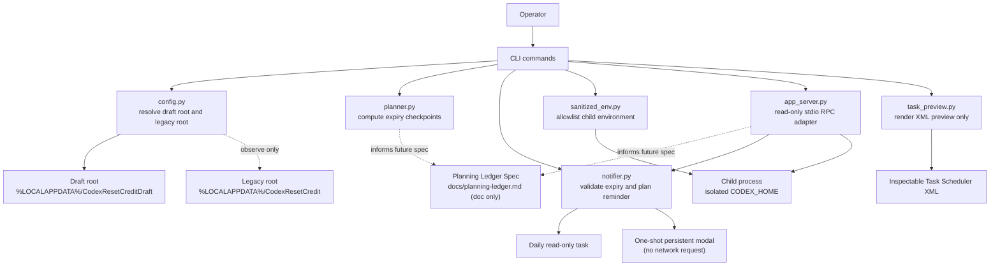

# Architecture

## Intent

This repository implements a read-only Codex reset-credit expiry observer and an optional Windows reminder. It reads the server-provided expiry through Codex app-server and schedules a local dialog; it does not redeem anything.

## Design goals

1. keep the existing `%LOCALAPPDATA%\CodexResetCredit` installation untouched
2. isolate all new state under a separate notifier or draft root
3. prevent ambient secret inheritance into child processes
4. make planning logic deterministic and testable without account access
5. keep local reminder scheduling separate from any account mutation
6. use only the Codex app-server read surface for live account observation

## Provenance boundary

This repository is an independently written public preview. It should not be presented as a formally isolated legal clean-room deliverable, because earlier evaluation work included reading an unlicensed third-party repository. That matters for provenance wording, not for the technical boundaries below.

## System boundaries

### In scope today

- draft root selection
- isolated child `CODEX_HOME`
- isolated child `CODEX_SQLITE_HOME`
- environment-name allowlist
- Phase 1 read-only app-server observability adapter (`observe-rate-limits`) using documented RPC methods (`initialize`, `initialized`, `account/read`, `account/rateLimits/read`)
- expiry checkpoint planning
- nearest-available-credit validation and selection
- one optional daily read-only Windows task
- one deterministic local one-shot modal reminder at T−12 hours
- Phase 1.5 planning-ledger specification and operator review model
- read-only Scheduled Task XML rendering
- unit tests for the above

### Explicitly out of scope today

- live `account/rateLimitResetCredit/consume`
- scheduled reset activation or redemption
- direct private backend HTTP
- direct credential-file parsing or auth scraping helpers
- frequent background polling or a resident daemon
- mutation of the legacy local install

## Trust model

### Trusted inputs

- local code in this repository
- explicit CLI arguments supplied by the operator
- local clock for deterministic timestamp planning

### Semi-trusted inputs

- the ambient shell environment, which is treated as overshared and filtered
- the presence of a `codex` binary on `PATH`
- read-only response objects returned by `codex app-server --stdio`

### Untrusted or protected areas

- unrelated environment variables and API keys
- auth artifacts outside the draft root
- legacy runtime state under `%LOCALAPPDATA%\CodexResetCredit`
- private backend endpoints and undocumented contracts

## Runtime shape

## Current components

| Component | Responsibility | Current safety property |
| --- | --- | --- |
| `config.py` | Resolves draft root, child Codex home, legacy install root, and optional `codex` binary path | Keeps draft state separate from the known legacy install path |
| `sanitized_env.py` | Builds a child-process environment from a small allowlist | Prevents unrelated tokens and secrets from being inherited by default |
| `app_server.py` | Executes stdio JSONL handshake and read RPCs (`account/read`, `account/rateLimits/read`) | strictly read-only, masks emails, parses timestamps flexibly, detects environment drift |
| `notifier.py` | Validates complete inventory, selects the nearest expiry, manages namespaced tasks/state, and displays the modal | No consume path, no raw ID in tasks/state, fail-closed validation |
| `planner.py` | Computes warmup, validation, and dispatch timestamps from expiry | Pure function; easy to test without network or auth |
| `task_preview.py` | Renders one-time Scheduled Task XML | Generates inspectable output without touching Task Scheduler |
| `cli.py` | Exposes diagnostic, planning, observation, and notifier commands | Requires `--allow-live-read` for live observation; notifier display performs no live read |

## Environment scrubbing model

The child environment is intentionally small. The current allowlist preserves only machine and shell basics such as `PATH`, `SYSTEMROOT`, `TEMP`, and user profile paths. It does not forward arbitrary API keys, model tokens, or unrelated auth state.

Crucially, environment construction and preview only read values for allowlisted variables. For non-allowlisted (stripped) variables, the implementation only observes variable names when diffing environment state; non-allowlisted secret values are never read into memory for forwarding, logged, or transmitted anywhere.

The child environment then adds:

- `CODEX_HOME=<draft-root>/codex-home`
- `CODEX_SQLITE_HOME=<draft-root>/codex-home/sqlite`
- `PYTHONUTF8=1`

The standalone planning and observation commands use that isolated default. The installed notifier instead receives an explicitly validated path to the current signed-in `CODEX_HOME`; the manager never opens or parses its credential files, and Codex app-server remains responsible for normal authentication. SQLite scratch state remains isolated.

This is one of the main reasons the repository exists. The earlier legacy direction needed hardening against accidental secret inheritance, and that class of failure is cheap to prevent if it is designed in from the beginning.

## Planning model

Planning is currently a pure timestamp transform:

- `warmup_at_utc = expires_at_utc - warmup_seconds`
- `validation_at_utc = expires_at_utc - validation_seconds`
- `dispatch_at_utc = expires_at_utc - dispatch_seconds`

The constraints are also explicit:

- timestamps must be timezone-aware
- offsets must be strictly descending
- all offsets must be positive

This lets the team reason about future execution windows without touching any real credit state.

## Phase 1.5 planning-ledger model

The next layer is deliberately still non-executable. A planning ledger is a static, operator-reviewed artifact shape that ties together:

- a chosen expiry target
- the checkpoint timestamps derived from that target
- any read-only observations that justify the target
- human review notes before any future action path is even considered

The important boundary is that the repository currently specifies this artifact; it does not yet generate or execute it automatically.

## Scheduler-preview model

The original `preview-task` command still renders XML without registration:

- `StartWhenAvailable=true`
- `ExecutionTimeLimit=PT5M`
- `MultipleInstancesPolicy=IgnoreNew`
- `WakeToRun=false`
- no registration step

## Installed notifier model

The optional installer creates only:

1. `CodexResetCreditNotifier-DailyCheck`, which performs one read-only observation per day.
2. `CodexResetCreditNotifier-Notice-<fingerprint>`, which opens the saved local reminder at T−12 without contacting Codex.

The one-shot task uses `InteractiveToken`, `LeastPrivilege`, `StartWhenAvailable`, `WakeToRun`, `IgnoreNew`, an expiry `EndBoundary`, and `ExecutionTimeLimit=PT0S` so the modal is not killed automatically. State and task actions contain a SHA-256 fingerprint rather than the raw credit ID.

## Threat model

### Main failure modes we are trying to eliminate now

1. secret or token leakage through inherited environment variables
2. accidental writes into the legacy local installation
3. mutation of unrelated Scheduled Tasks
4. documentation drift that makes a read-only notifier look like a reset bot
5. future coupling to undocumented private endpoints
6. planning-ledger outputs being mistaken for an execution queue

### Residual timing and platform risks

1. firmware or Windows power policy can prevent an exact wake
2. `StartWhenAvailable` catch-up can be delayed
3. a modal cannot appear while its Windows user is signed out
4. a once-daily check can first discover a credit after its T−12 target
5. app-server currently provides one-second rather than fractional-second expiry precision

Live consume idempotency, read-after-consume reconciliation, and operator approval remain deferred because no redemption path exists.

## Future extension points

Any future live path should remain behind a separate capability boundary, explicit operator intent, and a fresh policy review.

That means the likely order is:

1. keep read-only observability and the reminder auditable
2. improve non-mutating planning and status artifacts
3. monitor documented app-server contract changes
4. only then decide whether any user-initiated `consume` path should exist

## Release gates

Before any live-feature transition or materially broader product claim, this repository should pass all of the following:

1. provenance decision for publication
2. terms-risk review for any live behavior
3. explicit split between read-only and mutating code paths
4. scheduler and secret-handling audit
5. documentation review to ensure the repository page matches reality
