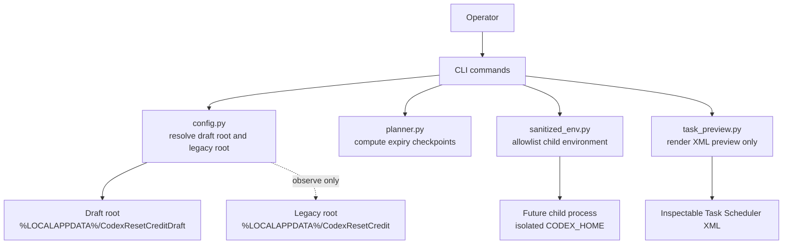

# Architecture

## Intent

This repository currently implements a read-only foundation for a future-safe Codex reset-credit workflow. The goal of the first milestone is not to redeem anything. The goal is to prove that isolation, planning, and documentation can be made trustworthy before any live mutation path exists.

## Design goals

1. keep the existing `%LOCALAPPDATA%\CodexResetCredit` installation untouched
2. isolate all new state under a separate draft root
3. prevent ambient secret inheritance into child processes
4. make planning logic deterministic and testable without account access
5. preview Windows task behavior without registering anything
6. keep the architecture compatible with documented Codex surfaces if a future read-only adapter is added

## Provenance boundary

This repository is an independently written public preview. It should not be presented as a formally isolated legal clean-room deliverable, because earlier evaluation work included reading an unlicensed third-party repository. That matters for provenance wording, not for the technical boundaries below.

## System boundaries

### In scope today

- draft root selection
- isolated child `CODEX_HOME`
- isolated child `CODEX_SQLITE_HOME`
- environment-name allowlist
- expiry checkpoint planning
- read-only Scheduled Task XML rendering
- unit tests for the above

### Explicitly out of scope today

- live `account/rateLimitResetCredit/consume`
- Scheduled Task registration
- direct private backend HTTP
- auth scraping helpers
- background daemons
- mutation of the legacy local install

## Trust model

### Trusted inputs

- local code in this repository
- explicit CLI arguments supplied by the operator
- local clock for deterministic timestamp planning

### Semi-trusted inputs

- the ambient shell environment, which is treated as overshared and filtered
- the presence of a `codex` binary on `PATH`
- any future read-only response from `codex app-server`

### Untrusted or protected areas

- unrelated environment variables and API keys
- auth artifacts outside the draft root
- legacy runtime state under `%LOCALAPPDATA%\CodexResetCredit`
- private backend endpoints and undocumented contracts

## Runtime shape

## Current components

| Component | Responsibility | Current safety property |
| --- | --- | --- |
| `config.py` | Resolves draft root, child Codex home, legacy install root, and optional `codex` binary path | Keeps draft state separate from the known legacy install path |
| `sanitized_env.py` | Builds a child-process environment from a small allowlist | Prevents unrelated tokens and secrets from being inherited by default |
| `planner.py` | Computes warmup, validation, and dispatch timestamps from expiry | Pure function; easy to test without network or auth |
| `task_preview.py` | Renders one-time Scheduled Task XML | Generates inspectable output without touching Task Scheduler |
| `cli.py` | Exposes `doctor`, `env-preview`, `plan`, `preview-task`, `dry-run` | Keeps the current user experience read-only |

## Environment scrubbing model

The child environment is intentionally small. The current allowlist preserves only machine and shell basics such as `PATH`, `SYSTEMROOT`, `TEMP`, and user profile paths. It does not forward arbitrary API keys, model tokens, or unrelated auth state.

Crucially, environment construction and preview only read values for allowlisted variables. For non-allowlisted (stripped) variables, the implementation only observes variable names when diffing environment state; non-allowlisted secret values are never read into memory for forwarding, logged, or transmitted anywhere.

The child environment then adds:

- `CODEX_HOME=<draft-root>/codex-home`
- `CODEX_SQLITE_HOME=<draft-root>/codex-home/sqlite`
- `PYTHONUTF8=1`

This is one of the main reasons the repository exists. The earlier legacy direction needed hardening against accidental secret inheritance, and that class of failure is cheap to prevent if it is designed in from the beginning.

## Planning model

Planning is currently a pure timestamp transform:

- `warmup_at_utc = expires_at_utc - warmup_seconds`
- `validation_at_utc = expires_at_utc - validation_seconds`
- `dispatch_at_utc = expires_at_utc - dispatch_seconds`

The constraints are also explicit:

- timestamps must be timezone-aware
- offsets must be strictly descending
- all offsets must be positive

This lets the team reason about future execution windows without touching any real credit state.

## Scheduler-preview model

The repository currently renders XML for a one-time Windows task with the following important properties:

- `StartWhenAvailable=true`
- `ExecutionTimeLimit=PT5M`
- `MultipleInstancesPolicy=IgnoreNew`
- `WakeToRun=false` in the current preview template
- no registration step

The last point is the important one. Preview generation is documentation and inspection, not activation.

## Threat model

### Main failure modes we are trying to eliminate now

1. secret or token leakage through inherited environment variables
2. accidental writes into the legacy local installation
3. hidden scheduler side effects during local testing
4. documentation drift that makes a read-only repo look like a live reset bot
5. future coupling to undocumented private endpoints

### Risks intentionally deferred

1. live consume idempotency rules
2. read-after-consume reconciliation
3. partial backend failure handling
4. task wake behavior on sleeping laptops
5. operator approval and terms gating for any real redemption flow

Those deferred risks are real, but they belong to later milestones and should not leak into the current MVP by implication.

## Future extension points

If the project continues, the safest next adapter is a read-only one that talks to documented `codex app-server` methods such as `account/rateLimits/read`. Any future live path should remain behind a separate capability boundary, explicit operator intent, and a fresh policy review.

That means the likely order is:

1. read-only observability
2. planning ledger and audit artifacts
3. only then a decision about whether a user-initiated `consume` path should exist

## Release gates

Before any live-feature transition or materially broader product claim, this repository should pass all of the following:

1. provenance decision for publication
2. terms-risk review for any live behavior
3. explicit split between read-only and mutating code paths
4. scheduler and secret-handling audit
5. documentation review to ensure the repository page matches reality
